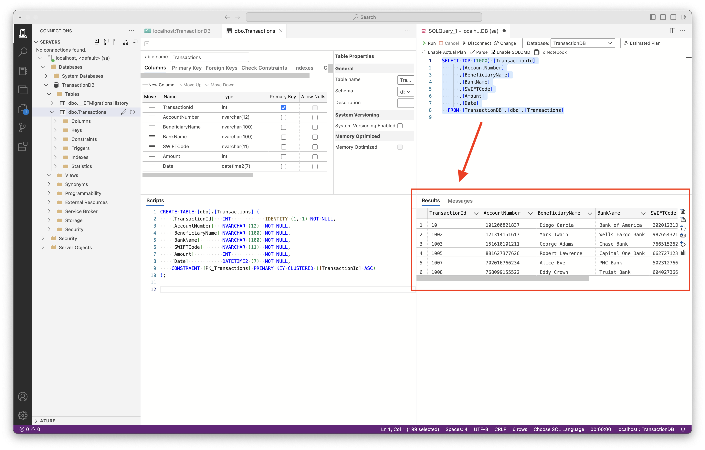
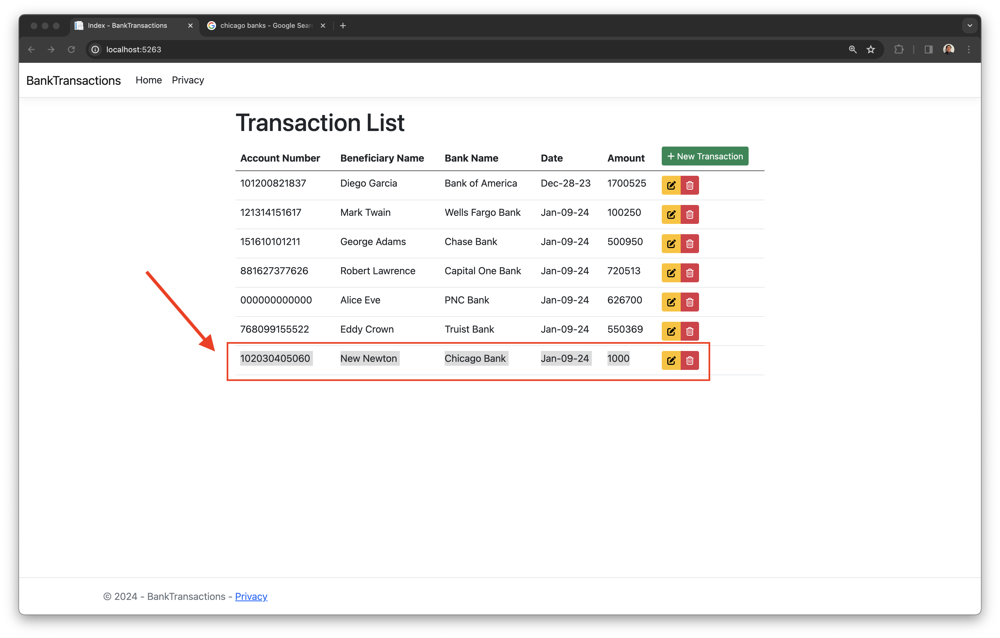

# BankTransactions Asp.Net App

---
## Overview

This ASP.NET Core MVC project features CRUD operations using Entity Framework Core and is underpinned by a containerized Azure SQL Edge database, showcasing the integration of cutting-edge database technologies in modern web application development.

## Technologies and Tools

- [x] ASP.NET Core MVC
    <!--* Utilized for crafting the web application using the MVC design pattern, ensuring a clean separation of concerns and enhanced maintainability.-->
- [x] Entity Framework Core
    <!--* Employed for efficient Object-Relational Mapping, enabling seamless interactions between the application and the SQL database.-->
- [x] Azure SQL Edge (Docker Container)
    <!--* Integrated a high-performance, scalable SQL database using Docker.-->
- [x] Azure Data Studio
    <!--* Used for database management and query execution, enhancing database interaction and management.-->
- [x] Bootstrap & FontAwesome
    <!--* Enhanced the user interface with responsive design and visually appealing icons.-->
- [x] Visual Studio 2022
    <!--* IDE used, leveraging its comprehensive suite of tools for .NET development.-->

## Architecture

- [x] Model-View-Controller (MVC) Architectural Pattern
    <!--* The application follows the MVC architectural pattern.-->
- [x] Entity Framework Core DB First Approach
    <!--* Directly mapped the database schema to the business domain entities, resulting in a database-driven application design.-->
- [x] Dependency Injection (DI) Design Pattern 
    <!--* Leveraged built-in dependency injection in ASP.NET Core for managing services and database context, ensuring loose coupling and testability.-->

## Methodologies

- [x] CRUD Operations
    <!--* Implementation of basic database operations: Create, Read, Update, Delete.-->
- [x] Containerized Database
    <!--* Deployed Azure SQL Edge within a Docker container-->
- [x] Client-side and Server-side Validation
    <!--* Ensuring data integrity both on the client and server sides.-->
- [x] Database Migrations
    <!--* Utilized EF Core migrations for updating and managing the database schema.-->

## App Walkthrough

* **This screenshot shows Azure SQL Edge running within a Docker container, demonstrating the setup of a scalable and isolated database environment.** 

* **Here, Azure Data Studio displays the Transaction Database, showcasing the effective management and querying capabilities of the tool as well as records prevously inserted to the system.** 

* **The project's structure and folder hierarchy are illustrated here, with a focus on the TransactionController.cs file, which is central to our CRUD operations.**

* **This image captures the web application's Transaction Index View in action, displaying a list of transactions managed by the system.**

* **The Transaction AddOrEdit View is shown here, triggered by selecting the 'Edit' option for a transaction, ready for data modification.**

* **Illustrating the edit functionality, this screenshot shows the process of changing an account number and submitting the updated data.**

* **Post-edit, this view displays the Transaction with the updated 'Account Number', confirming the successful data modification."**

* **This image showcases the Transaction AddOrEdit View, ready for entering a new transaction's details, demonstrating the application's capacity for data addition.**

* **The Transaction Index view here includes the newly added transaction, highlighting the system's real-time update capability.**

* **The final screenshot verifies the persistence of edited and newly added transactions in the Transaction Database, ensuring data integrity and accuracy.**

---
## Final Thoughts

* This project exemplifies modern web application development, merging ASP.NET Core MVC with Entity Framework Core and Dockerized Azure SQL Edge, showcasing advanced integration of key technologies and best practices.

## Resources

* https://hub.docker.com/_/microsoft-azure-sql-edge