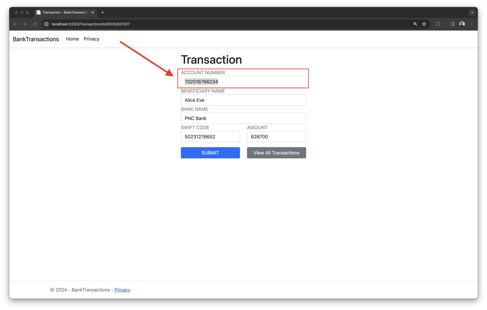
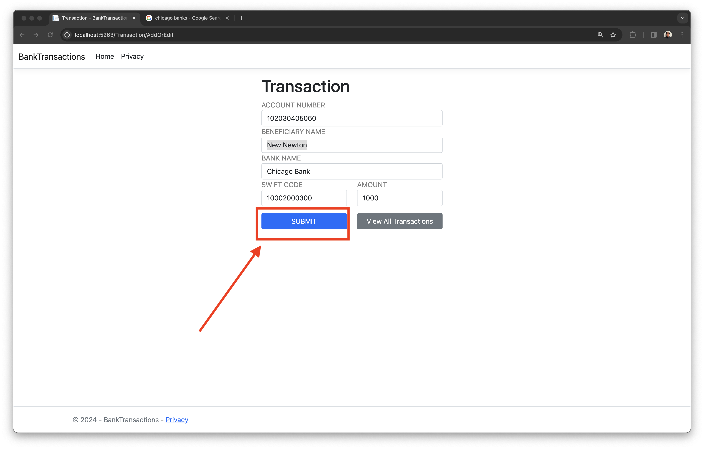
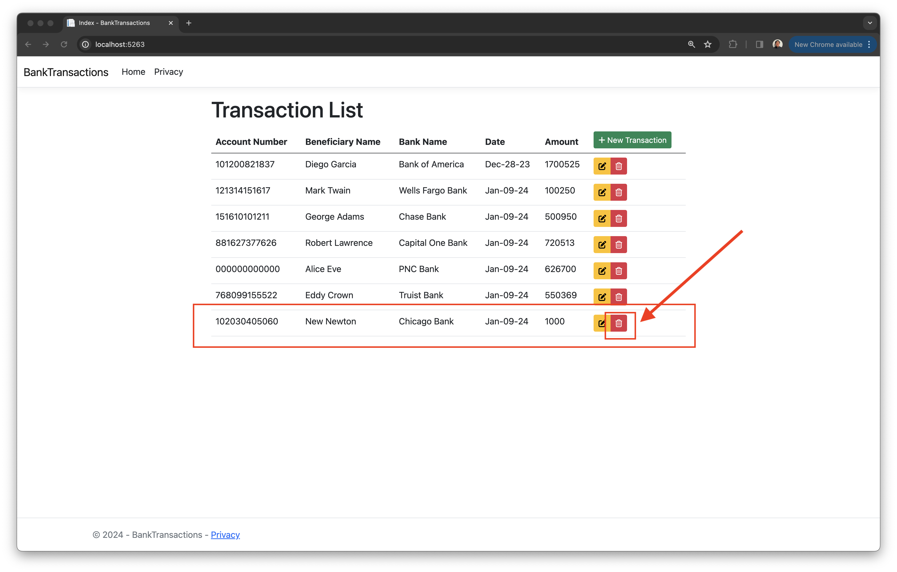
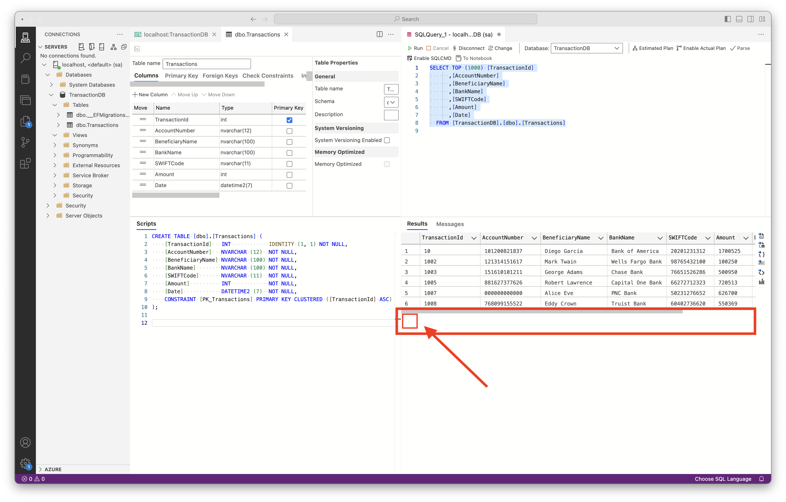

# BankTransactions Asp.Net App

## Overview

**This ASP.NET Core MVC application utilizes Entity Framework Core for CRUD operations and integrates a containerized Azure SQL Edge database, demonstrating advanced database technology in web development.**

## User Stories

The following functionality is achieved:

- [x] User can add a new bank transaction.
- [x] User can edit a bank transaction.
- [x] User can remove a bank transaction.

---

## Technologies and Tools

- [x] ASP.NET Core MVC
    <!--* Utilized for crafting the web application using the MVC design pattern, ensuring a clean separation of concerns and enhanced maintainability.-->
- [x] Entity Framework Core
    <!--* Employed for efficient Object-Relational Mapping, enabling seamless interactions between the application and the SQL database.-->
- [x] Azure SQL Edge in Docker Container
    <!--* Integrated a high-performance, scalable SQL database using Docker.-->
- [x] Azure Data Studio
    <!--* Used for database management and query execution, enhancing database interaction and management.-->
- [x] Bootstrap & FontAwesome
    <!--* Enhanced the user interface with responsive design and visually appealing icons.-->
- [x] Visual Studio 2022
    <!--* IDE used, leveraging its comprehensive suite of tools for .NET development.-->

## Architecture

- [x] Model-View-Controller (MVC) Architectural Pattern
    <!--* The application follows the MVC architectural pattern.-->
- [x] Entity Framework Core DB First Approach
    <!--* Directly mapped the database schema to the business domain entities, resulting in a database-driven application design.-->
- [x] Dependency Injection (DI) Design Pattern 
    <!--* Leveraged built-in dependency injection in ASP.NET Core for managing services and database context, ensuring loose coupling and testability.-->

## Methodologies

- [x] CRUD Operations
    <!--* Implementation of basic database operations: Create, Read, Update, Delete.-->
- [x] Containerized Database
    <!--* Deployed Azure SQL Edge within a Docker container-->
- [x] Client-side and Server-side Validation
    <!--* Ensuring data integrity both on the client and server sides.-->
- [x] Database Migrations
    <!--* Utilized EF Core migrations for updating and managing the database schema.-->

---

## App Walkthrough

### App setup

* **1 - Azure SQL Edge running within a Docker container.** 

* **2 - Azure Data Studio displaying the Transaction DB.** 

* **3 - Project's structure, displaying the 'TransactionController.cs' file, central to CRUD operations.**

---

### User Story: User can Edit a transaction.

* **1 - Web application's Transaction Index-View in action, displaying a list of transactions managed by the system.**

* **2 - The Transaction AddOrEdit-View is shown here, triggered by selecting the 'Edit' button for a transaction, ready for data modification.**

* **3 - Illustrating the edit functionality, this screenshot shows the process of updating transaction properties, in this case updating the 'Account Number' field and submitting the updated data.**

* **4 - Post-edit, this view displays the Transaction with the updated 'Account Number', confirming the successful data modification."**

---

### User Story: User can Add a new transaction.

* **1 - Pressing 'New Transaction' button.**

* **2 - Displaying Transaction AddOrEdit-View, ready for entering a new transaction's details, demonstrating the application's capacity for data addition.**

* **3 - The Transaction Index-View here includes the newly added transaction, highlighting the system's real-time update capability.**

* **4 - Verifying the persistence of edited and newly added transactions in the Transaction Database, ensuring data integrity and accuracy.**

---

### User Story: User can Remove a transaction.

* **1 - Pressing the 'Delete' button for a certain transaction.**

* **2 - Pressing 'OK' in the deletion confirmation box.**

* **3 - Transaction Index-View automatically updated without displaying the last deleted transaction record.**

* **4 - Verifying deletion recorded in the Transaction Database, ensuring data integrity and accuracy.**

---
## Final Thoughts

* This project exemplifies modern web application development, merging ASP.NET Core MVC with Entity Framework Core and Dockerized Azure SQL Edge, showcasing advanced integration of key technologies and best practices.

## Resources

* https://hub.docker.com/_/microsoft-azure-sql-edge
